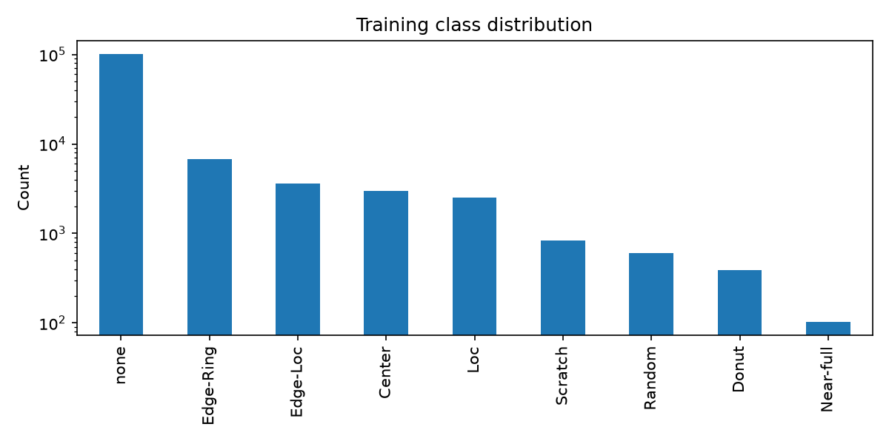
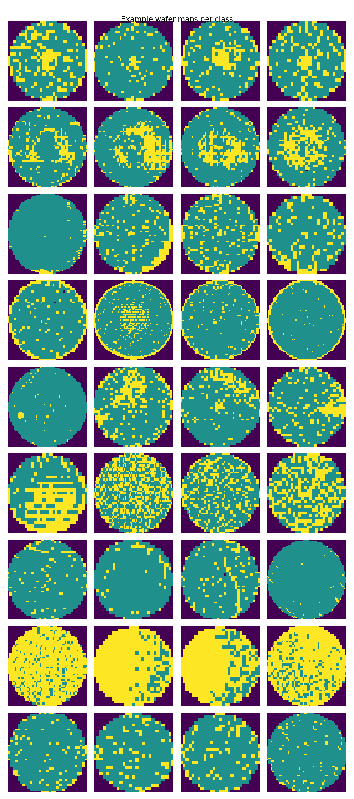
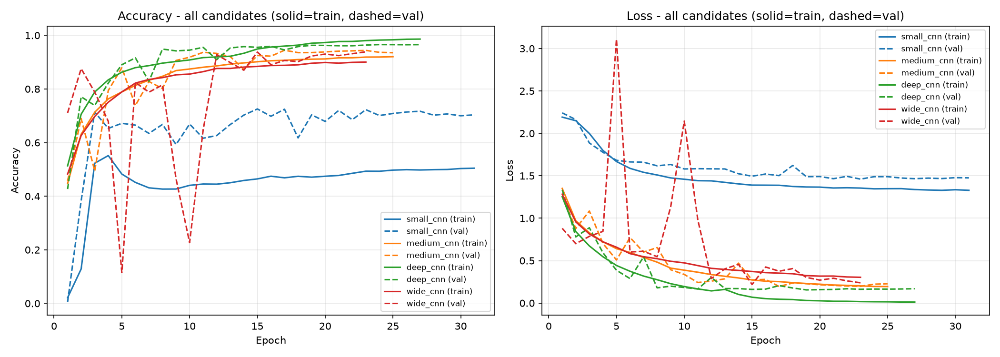
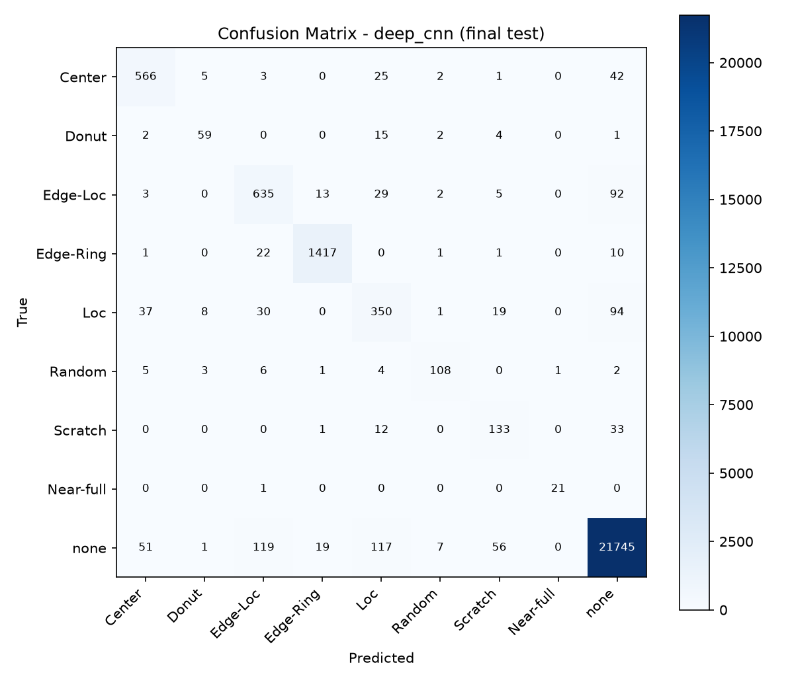
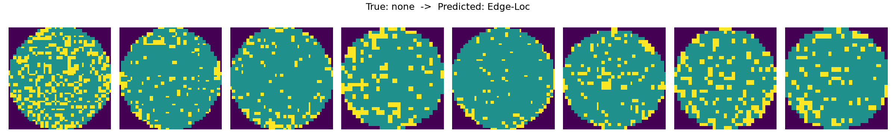
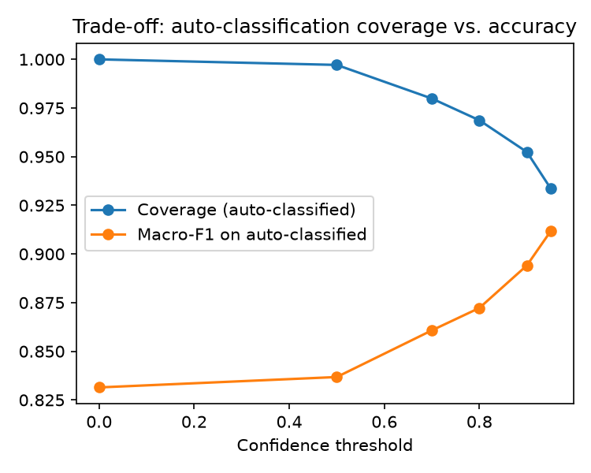

# Wafer Defect Pattern Classification (CNN on WM-811K)

A CNN that classifies semiconductor wafer maps into 9 failure-pattern classes (e.g. `Edge-Ring`,
`Center`, `Scratch`, `Loc`, `none`), with an emphasis on doing the ML *rigorously* — fair
architecture comparison, leakage checking, confidence-based routing — and connecting the output
to what a fab would actually do with it.

## Why this matters

After wafer test, each die on a wafer is marked pass/fail. The *spatial pattern* of failures across
a wafer is a signature of what went wrong upstream — a ring of failures at the edge usually means
an edge-handling issue, a cluster at the center usually means non-uniform deposition/etch, a thin
line means a physical scratch during handling, and so on. Automatically classifying this pattern
means failures can be routed to the right engineering team faster than manual inspection.

## Results

| Metric | Value |
|---|---|
| Best model | `deep_cnn` |
| Validation macro-F1 | 0.835 |
| Test macro-F1 (one-time, final) | 0.817 |
| Test accuracy | 96.1% |
| Auto-classification coverage @ 0.90 confidence | 94.5% (macro-F1 0.892 on that subset) |

Full per-class metrics, error analysis, and the confidence/coverage trade-off are in the notebook.

## Repo structure

```
├── wafer_defect_cnn.ipynb        # full pipeline: EDA -> baseline -> model comparison -> error analysis
├── data_loader.py                 # loads and preprocesses WM-811K into train/val/test .npz
├── data/                          # (not committed) place wm811k_processed.npz here
├── figures/                       # saved plots (see below)
├── wafer_defect_cnn.keras         # trained model weights (best candidate)
├── app.py                         # Streamlit demo
└── requirements.txt
```

## Method summary

1. **EDA first** — class balance, example maps per class, and a leakage check (found and removed
   duplicate wafer maps across train/val/test splits).
2. **Baseline** — majority-class predictor, to make sure macro-F1 (not accuracy) is the right
   metric given ~85% of wafers have no defect pattern.
3. **Fair model comparison** — four CNN architectures (`small`, `medium`, `wide`, `deep`) trained
   under identical seeds, splits, and training budget.
4. **Model selection on validation only**, test set touched exactly once for the final number.
5. **Error analysis** on the winning model's actual misclassified maps, not just the confusion matrix.
6. **Confidence-based routing** — quantifies the coverage/accuracy trade-off of sending low-confidence
   predictions to manual review instead of trusting every prediction equally.
7. **Root-cause mapping** — connects each predicted class to the engineering team/action it would
   trigger in a real fab.

## Visuals to include (figures/ folder)

1.  — bar chart of class counts (shows the ~85% `none` imbalance
   that motivates using macro-F1).
2.  — one example wafer map per class, so a reader immediately understands
   what each pattern looks like without needing the writeup above.
3.  — val accuracy/loss curves for all four architectures,
   showing the early-epoch instability discussed in the conclusion.
4.  — final test-set confusion matrix for the winning model.
5.  — sample of actual misclassified wafer maps for the most
   common confusion pair (this is the most visually convincing figure — it lets a reviewer see
   *why* the model struggles, not just that it does).
6.  — coverage vs. macro-F1 trade-off curve.

Suggested placement: 1–2 near the top (right after Results), 3–4 in a "Model Selection" section,
5 in an "Error Analysis" section, 6 in a "Production Considerations" section.

## Demo

A small Streamlit app (`app.py`) lets you upload or pick a sample wafer map and see the predicted
class with confidence scores. See setup below.

## Setup

```bash
pip install -r requirements.txt
python data_loader.py          
jupyter lab wafer_defect_cnn.ipynb
streamlit run app.py
```

## Known limitations

- Single-label classification only; real fab data sometimes has overlapping/mixed defect patterns.
- Trained on one dataset/fab process; generalization to other wafer sizes or fabs is untested.
- Leakage check is exact-duplicate detection only, not a full wafer/lot-ID audit (raw dataset
  doesn't expose lot IDs in the version used here).

## Next steps

See Section 14 of the notebook for the prioritized list (LR warmup, milder class weighting,
augmentation, pretrained backbone, per-class confidence thresholds).
